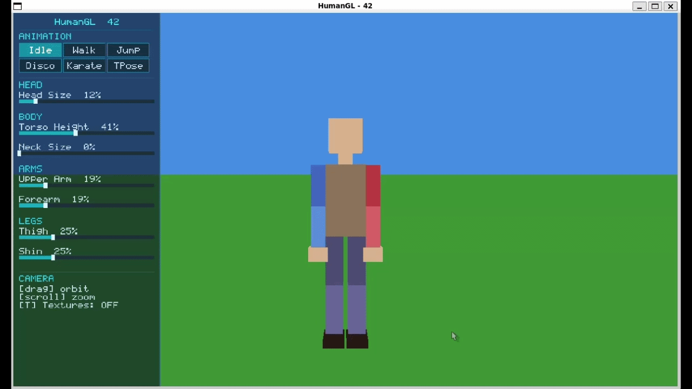
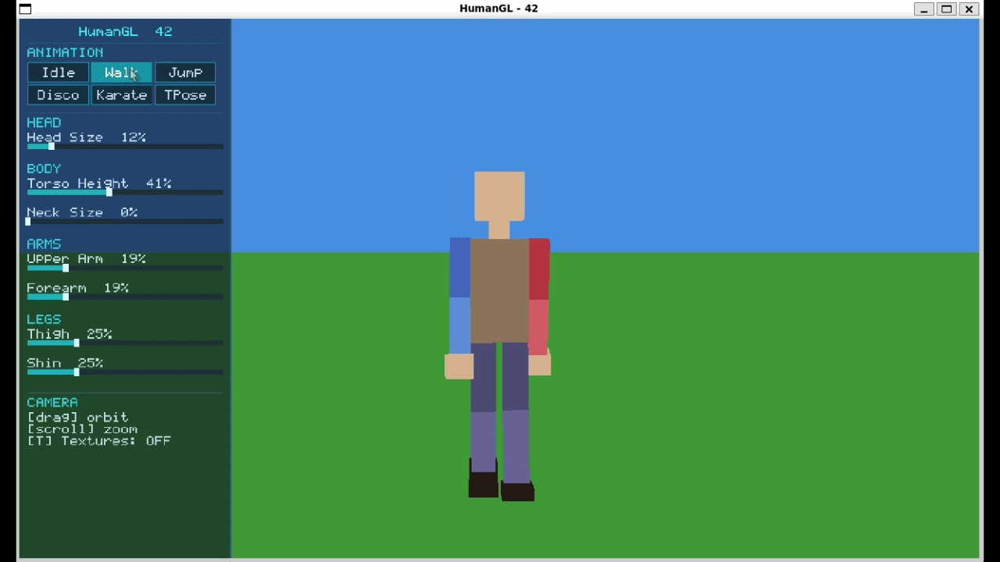
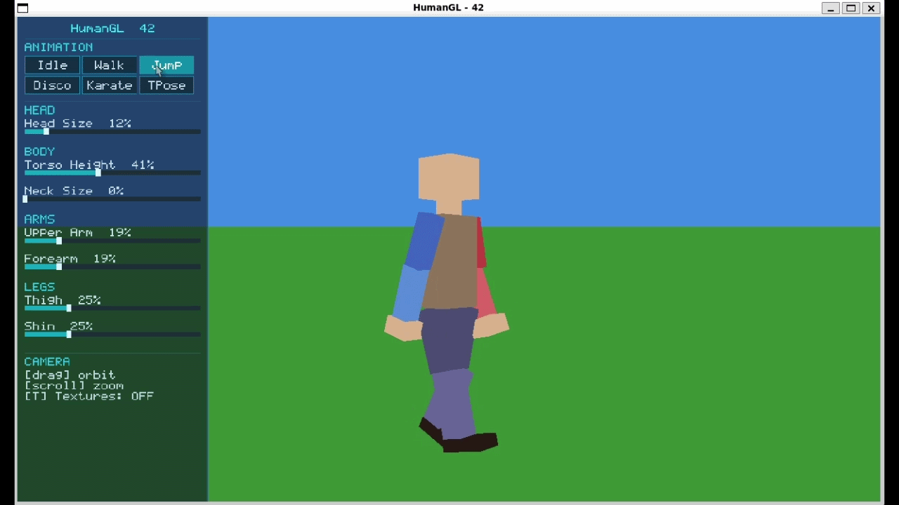
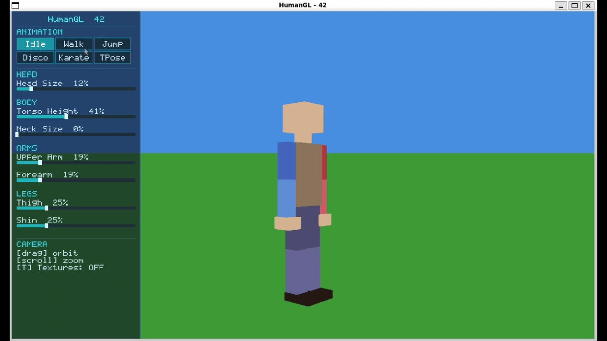
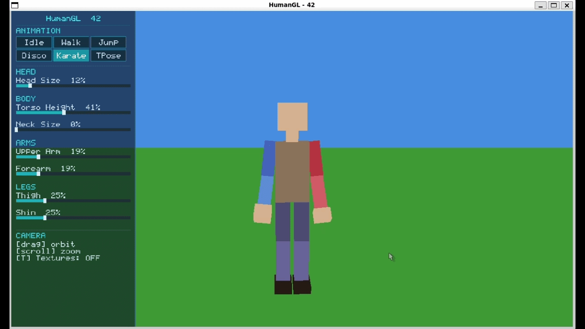
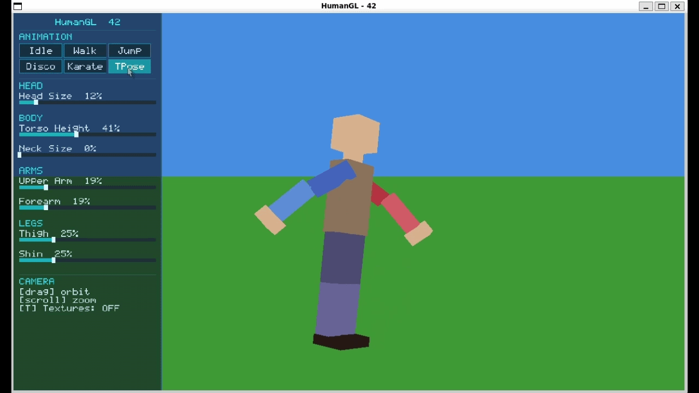
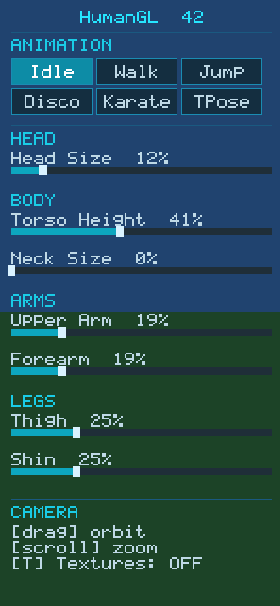
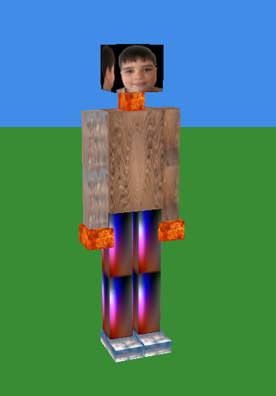

# HumanGL — 42

A 3D articulated human figure rendered with OpenGL 4.1 (Core Profile) using a custom matrix stack. No GLM, no external math library.


---

## Build & Run

```bash
dotnet build
dotnet run --project HumanGL.csproj
```

Requires .NET 8+ and a GPU that supports OpenGL 4.1 Core Profile.

---

## Controls

| Key / Input | Action |
|-------------|--------|
| `1` | Idle animation |
| `2` | Walk animation |
| `3` | Jump animation (one-shot) |
| `4` | Disco animation |
| `5` | Karate animation |
| `6` | T-Pose |
| `Tab` | Cycle selected limb (keyboard resize) |
| `+` / `=` | Grow selected limb |
| `-` | Shrink selected limb |
| `T` | Toggle textures |
| Left drag | Orbit camera |
| Scroll | Zoom in / out |
| `Esc` | Quit |

Panel buttons and sliders on the left side replicate all of the above with the mouse.

---

## Animations

| | |
|---|---|
|  |  |
| Idle — gentle torso bob | Walk — sinusoidal leg/arm swing |
|  |  |
| Jump — one-shot 4-phase | Disco — beat-driven point dance |
|  |  |
| Karate — 15s looping kata | T-Pose |

---

## UI Panel



The left-side panel lets you:
- Switch animations with clickable buttons
- Resize individual body segments with interactive sliders (HEAD, BODY, ARMS, LEGS)
- See the camera controls and texture toggle status

---

## Architecture

### Matrix Stack

All transforms are computed by hand in `src/Scene/MatrixStack.cs`. The stack mirrors OpenGL's old `glPushMatrix` / `glPopMatrix` API:

```
Push → translate to attachment point → apply joint rotation → draw → recurse children → Pop
```

Each node's world position is:

```
World = Parent.World × LocalTranslation × LocalRotation × LocalScale
```

Scale is applied **only for drawing** — it is not inherited by children. Children attach to the parent's geometry edges, not to a scaled coordinate frame.

### Body Hierarchy

```
Torso
├── Neck
│   └── Head
├── LeftUpperArm
│   └── LeftForeArm
│       └── LeftHand
├── RightUpperArm
│   └── RightForeArm
│       └── RightHand
├── LeftThigh
│   └── LeftShin
│       └── LeftFoot
└── RightThigh
    └── RightShin
        └── RightFoot
```

Child attachment points are `LocalOffset` values in pre-scale parent space (e.g. `(0, -0.5, 0)` places a child at the bottom edge of a unit-height parent, regardless of actual parent size).

### Animation System

Animations use a Unity-style state machine in `src/Animation/`:

- `AnimationStateBase` — abstract base with `Enter`, `Apply`, `Exit` hooks
- `Animator` — static state machine; detects `AnimationMode` changes, calls `Enter`/`Exit`, then `Apply` every frame
- Transitions blend smoothly over **0.15 s** by snapshotting all joint angles at the moment of switch and lerping to the new state's output

### Limb Resize

Sliders and keyboard both use `NodeResizer.SetSizeY`, which clamps size to `[0.20, 2.00]`, resizes the node, and recomputes all child `LocalOffset` values so joints stay flush at any scale.

---

## Textures



Press `T` to toggle. Place texture files in `assets/textures/`. Supported formats: PNG, JPG, TGA, BMP, PPM.

The head uses a **4×3 cube-map cross** layout — one image wrapping all 6 faces:

```
      [Top  ]
[Left][Front][Right][Back]
      [Bottom]
```

---

## Project Structure

```
src/
  Core/         App.cs, AppState.cs, InputHandler.cs, Program.cs
  Scene/        HumanModel.cs, BodyNode.cs, MatrixStack.cs, NodeResizer.cs
  Animation/    Animator.cs, AnimationState.cs
    States/     IdleState.cs, WalkState.cs, JumpState.cs,
                DiscoState.cs, KarateState.cs, TPoseState.cs
  Rendering/    Renderer.cs, Shader.cs, CubeMesh.cs, Texture.cs,
                ModelTextureLoader.cs, NullTexture.cs
  Math/         Mat4.cs, Vec2.cs, Vec3.cs, Vec4.cs
  UI/           BitmapFont.cs, UiRenderer.cs, Slider.cs, UiPanel.cs
shaders/
  vertex.glsl
  fragment.glsl
assets/
  textures/     Texture files loaded at startup
  images/       Screenshots and GIFs for this README
```
